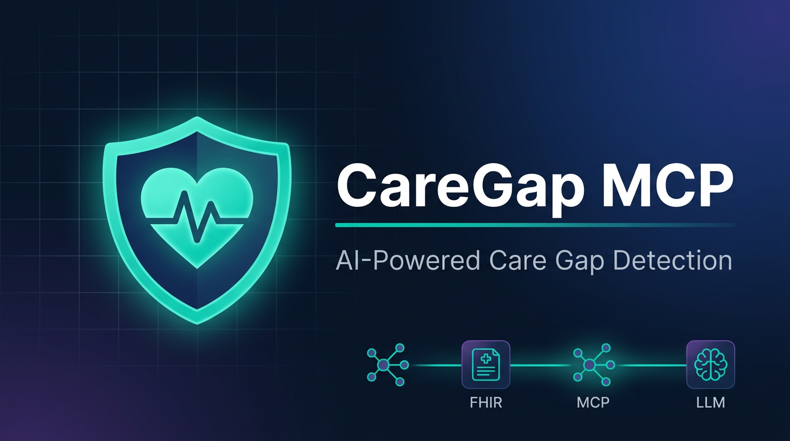
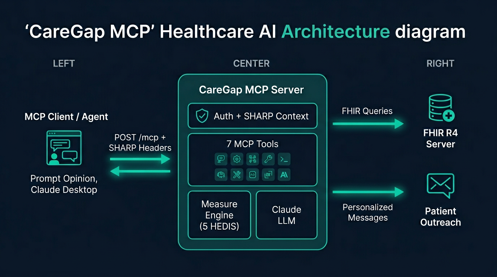
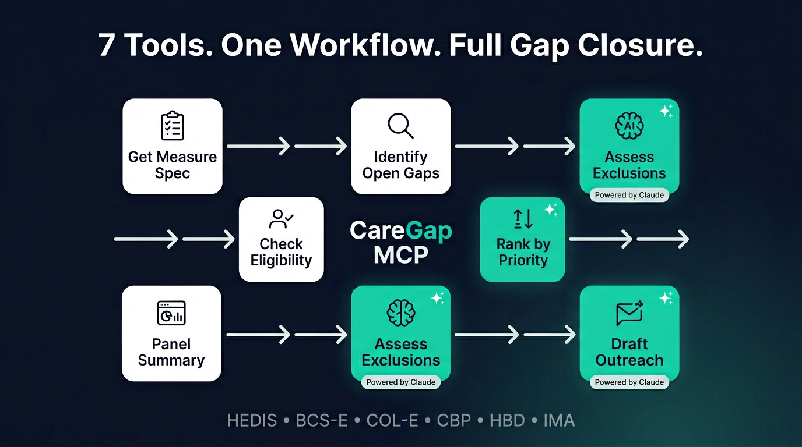
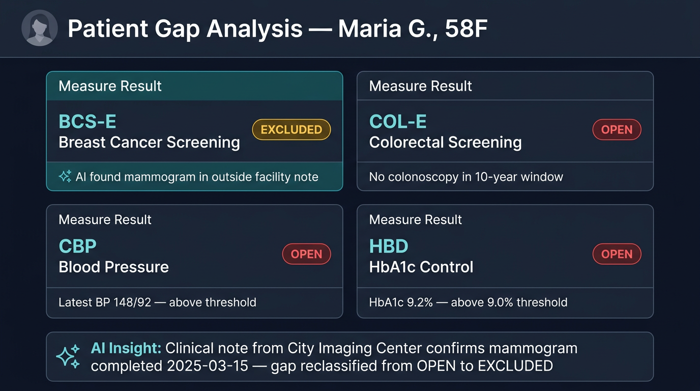
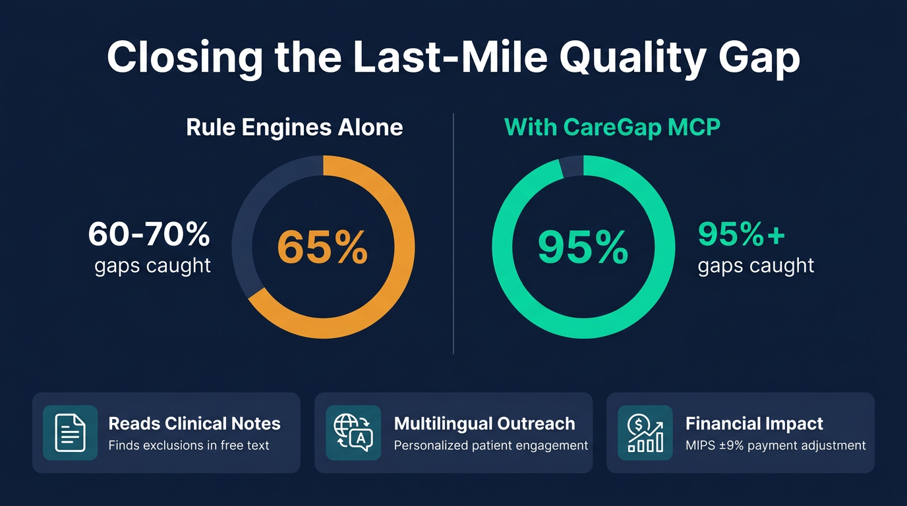

<p align="center">
  
</p>

# CareGap MCP

**AI-powered quality measure gap identification and closure, delivered as a SHARP-on-MCP server that plugs into any FHIR-connected healthcare AI agent.**

CareGap MCP evaluates patients against HEDIS/CMS quality measures, discovers exclusions buried in clinical notes using Claude, and generates personalized outreach — all through a standards-based MCP interface that works with the Prompt Opinion platform and any MCP-compatible client.

---

## Architecture



---

## Run the Demo in 60 Seconds

```bash
git clone <repo-url> && cd caregap-mcp
npm install
cp .env.example .env          # defaults to fixture mode — no external setup needed
npm run dev                   # starts on http://localhost:3333

# In another terminal — connect with MCP Inspector:
npx @modelcontextprotocol/inspector http://localhost:3333/mcp
```

The server ships with 4 synthetic patients (Synthea-generated FHIR R4 bundles) and `DRY_RUN` mode for LLM tools, so **zero external dependencies** are needed for the demo.

### Quick smoke test with curl

```bash
# Health check
curl http://localhost:3333/health

# List all tools
curl -X POST http://localhost:3333/mcp \
  -H "Content-Type: application/json" \
  -H "Accept: application/json, text/event-stream" \
  -d '{"jsonrpc":"2.0","id":1,"method":"tools/list","params":{}}'

# Run gap analysis for a patient
curl -X POST http://localhost:3333/mcp \
  -H "Content-Type: application/json" \
  -H "Accept: application/json, text/event-stream" \
  -d '{"jsonrpc":"2.0","id":2,"method":"tools/call","params":{
    "name":"identify_open_measure_gaps",
    "arguments":{"patientId":"patient-maria-001"}
  }}'
```

---

## Tools (MCP Superpowers)

<p align="center">
  
</p>

| Tool | Description | LLM? |
|------|-------------|------|
| `get_measure_specification` | Returns full HEDIS/CMS spec for a measure — denominator, numerator, exclusions, value sets with OIDs | No |
| `identify_open_measure_gaps` | Evaluates a patient against all measures. Returns open/closed/excluded/not_eligible with evidence | No |
| `calculate_measure_eligibility` | Detailed criterion-by-criterion eligibility breakdown for a specific measure | No |
| `assess_measure_exclusions` | AI reads clinical notes to find exclusions rule engines miss — hospice, outside screenings, refusals | **Yes** |
| `draft_patient_outreach` | Generates personalized, literacy-appropriate outreach messages (SMS/email/portal/letter) | **Yes** |
| `rank_gaps_by_priority` | AI ranks open gaps by clinical urgency, time-to-close, and engagement likelihood | **Yes** |
| `panel_gap_summary` | Program director view — gap counts per measure across the panel, sorted by financial impact | No |

---

## Measures Implemented

| ID | Measure | Why It Demos Well |
|----|---------|-------------------|
| `BCS-E` | Breast Cancer Screening | Classic exclusion problem (bilateral mastectomy) — great LLM demo |
| `COL-E` | Colorectal Cancer Screening | Multiple valid screening modalities with different lookback windows |
| `CBP` | Controlling High Blood Pressure | Needs latest BP observation — FHIR date reasoning |
| `HBD` | HbA1c Control for Diabetes | Combines Condition + Observation evaluation |
| `IMA` | Immunizations for Adolescents | Pediatric age-band logic with multi-vaccine requirements |

---

## Synthetic Patients

<p align="center">
  
</p>

| ID | Name | Profile | Demonstrates |
|----|------|---------|-------------|
| `patient-maria-001` | Maria G. | 58F, DM+HTN, high A1c, uncontrolled BP | Open BCS/COL/CBP/HBD gaps; mammogram note from outside facility (LLM exclusion) |
| `patient-james-002` | James O. | 52M, colonoscopy 8yr ago, hospice | COL closed (in window); hospice note (LLM exclusion) |
| `patient-lin-003` | Lin C. | 45F, pregnant, DM, uncontrolled BP, Spanish-preferred | CBP excluded (pregnancy); HBD open; multilingual outreach |
| `patient-alex-004` | Alex R. | 16 NB, Tdap+MenACWY done, no HPV, Tagalog-preferred | IMA open at age 13 (missing HPV); non-English outreach |

---

## Adding a New Measure

1. Create `src/measures/specs/your-measure.ts` implementing `MeasureSpec`
2. Create `src/measures/evaluators/your-measure.ts` calling `registerEvaluator()`
3. Add the import to `src/measures/evaluators/index.ts`
4. Add the spec import to `src/measures/registry.ts`
5. Run `npm run check` — all tools automatically pick up the new measure

---

## SHARP-on-MCP Compliance

This server implements the [SHARP-on-MCP specification](https://sharponmcp.com) for healthcare AI interoperability:

| Requirement | Implementation | File |
|-------------|---------------|------|
| Advertise `fhir_context_required` capability | `capabilities.experimental.fhir_context_required = { value: true }` + `extensions["ai.promptopinion/fhir-context"]` with scopes | [`src/server.ts`](src/server.ts) |
| Read FHIR context from HTTP headers | Extracts `X-FHIR-Server-URL`, `X-FHIR-Access-Token`, `X-Patient-ID` | [`src/middleware/sharpContext.ts`](src/middleware/sharpContext.ts) |
| Return HTTP 403 when headers missing (fhir mode) | Express middleware rejects before MCP handler runs | [`src/middleware/sharpContext.ts`](src/middleware/sharpContext.ts) |
| Auth: Anonymous + API key | Bearer token checked against `MCP_API_KEYS` env var | [`src/middleware/auth.ts`](src/middleware/auth.ts) |

---

## Impact

<p align="center">
  
</p>

Quality measures drive billions in value-based payments across U.S. healthcare:

- **MIPS payment adjustment:** ±9% of Medicare Part B reimbursement based on quality measure performance ([CMS.gov](https://www.cms.gov/medicare/quality/value-based-programs/merit-based-incentive-payment-system))
- **MA Star Ratings:** Plans rated 4+ stars receive ~5% quality bonus payments; a single-star improvement can mean $50M+ annually for a large plan ([KFF](https://www.kff.org/medicare/issue-brief/medicare-advantage-star-ratings/))
- **HEDIS gap closure:** Rule engines typically catch 60-70% of closable gaps; the remaining 30-40% are locked in unstructured notes, external records, and patient-reported data — exactly what AI excels at

CareGap MCP addresses this last-mile problem by combining structured FHIR evaluation with LLM-powered clinical note analysis, catching exclusions and evidence that rule engines miss.

---

## Safety

- **Synthetic data only:** All patient data is Synthea-generated. No real PHI in the repository.
- **PHI redaction:** All log output passes through [`redact()`](src/util/redact.ts) which strips SSNs, DOBs, MRNs, emails, and phone numbers.
- **No persistence:** FHIR data is never written to disk. In-memory only during request processing.
- **SSRF protection:** FHIR client rejects private/loopback/link-local IPs unless explicitly allowed via `MCP_ALLOW_PRIVATE_FHIR=true`.
- **PHI scan CI check:** `npm run phi-scan` fails the build if SSN-like patterns appear in source or test files.
- **DRY_RUN mode:** LLM tools return deterministic fixtures without calling the Anthropic API.

---

## Configuration

| Variable | Default | Description |
|----------|---------|-------------|
| `MCP_MODE` | `fhir` | `fhir` (production) or `fixture` (bundled Synthea data) |
| `PORT` | `3333` | HTTP server port |
| `MCP_API_KEYS` | *(empty)* | Comma-separated API keys. Empty = anonymous access |
| `ANTHROPIC_API_KEY` | *(empty)* | Required when `DRY_RUN=false` |
| `LLM_MODEL` | `claude-sonnet-4-5` | Anthropic model for LLM tools |
| `LLM_MAX_TOKENS` | `2048` | Max output tokens per LLM call |
| `DRY_RUN` | `false` | `true` returns deterministic fixtures instead of calling LLM |
| `MCP_ALLOW_PRIVATE_FHIR` | `false` | Allow private/loopback FHIR server URLs |
| `LOG_LEVEL` | `info` | Pino log level |

---

## Development

```bash
npm run dev          # Start with tsx (hot reload)
npm run typecheck    # TypeScript strict mode check
npm run test         # Run all tests (vitest)
npm run check        # typecheck + test + PHI scan
npm run build        # Compile to dist/
npm run start        # Run compiled output
```

---

## License

Apache 2.0
